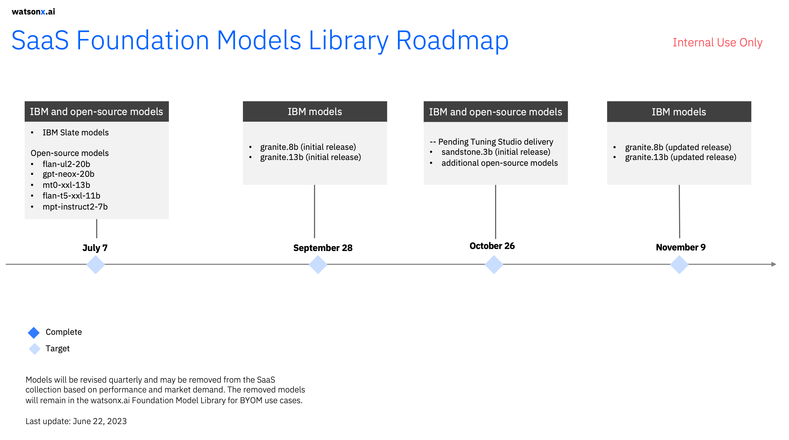
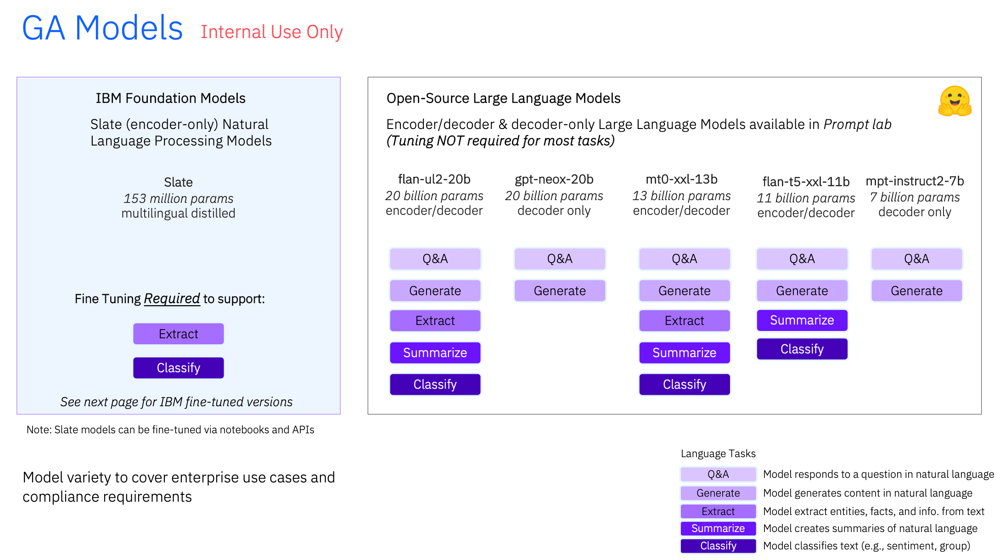
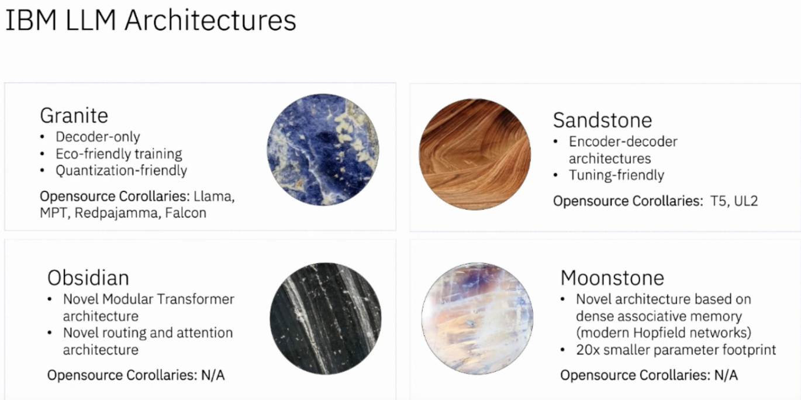

# IBM Foundation Models

## Required Viewing
[Watch the first 10:50 mins of this deep dive into the foundations of watsonx.ai](https://ibm.seismic.com/Link/Content/DC6GBT4VQcMGVGMHCjcD7fXXdRqP) by Kate Soule, Senior Manager, MIT-IBM Watson AI Lab, from the Q2 2023 IBM Tech Exchange.  She describes IBM data strategy for training models plus introduces the various IBM Foundation Models to-be-released in watsonx.ai.  We recommend watching only those first 11 mins as we'll return to Kate's video and watch section of Tuning models later in the Boot Camp.

## Foundation Model Roadmap
Here are the key timelines for release of IBM's various foundation models.  You also can [read more details about the watsonx.ai model roadmap on Seismic](https://ibm.seismic.com/Link/Content/DCVfj4mQD7jGT8qTC7gW3qJHWmHP).  The broader [watsonx roadmap is also on Seismic.](https://ibm.seismic.com/Link/Content/DCMmpHHmJchDq8qW3dM9TX8qjW9d)

  

  

## Optional Reading #1: Illustrated Transformer
Want to learn more about the Transformers that everyone's talking about?  Read this [blog post which visually illustrates many aspects of transformers](https://jalammar.github.io/illustrated-transformer/). 

## Optional Reading #2: Intro to Transformer Model Architectures
Kate quickly mentions Decoder-Only models plus Encoder-Decoder models.  It's valuable to understand the distinction between these plus when to use each type of model.  For exmple, you saw in Kate's presentation that IBM's Granite models (like MPT) are decoder-only models while IBM's Sandstone models are Encoder-Decoder models (like flan-ul2).  Here's a quick introduction to the [difference between encoder decoder model architecture and capabilities](https://magazine.sebastianraschka.com/p/understanding-encoder-and-decoder).

OK, now which of these architectures is used by the GPT family of models?
1. Encoder-Only
2. Encoder-Decoder
3. Decoder-Only

  

