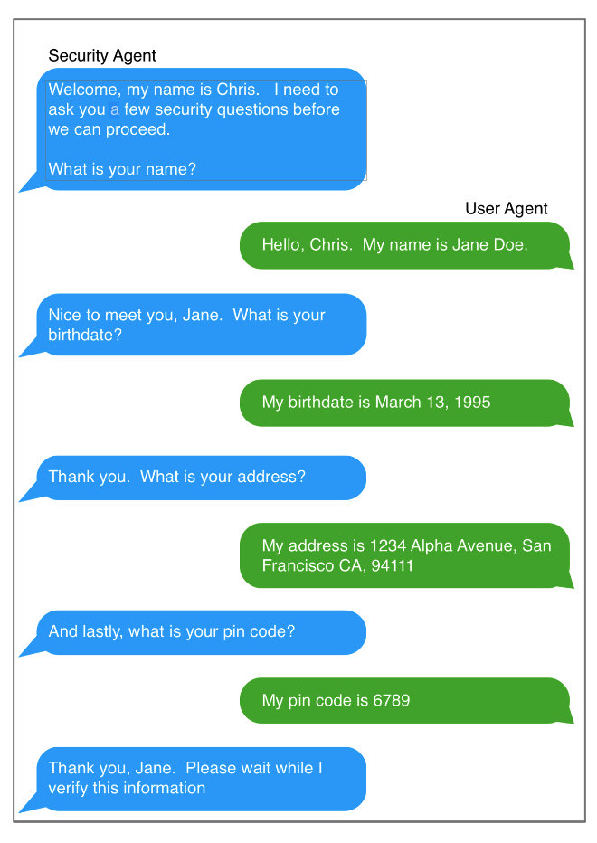

# Challenge 2 - Multi-turn interaction between two models

Your mission in this Challenge is to implement a multi-turn interaction between two models.  You saw an introduction to this in the [WatsonX and LangChain lab](../../self-guided-labs/level-1/lab-03-langchain-prompt-template) where you connected to models.  In that case, the first model was asked to generate a question and the second model generated a response.  Your task is to extend that approach to achieve a multi-turn interaction.  

  

Here are an approach to consider :
1. Try to give your models personalities
2. Have them engage in a conversation, ideally 5 or more back-and-forths.
3. Give the models a top for their conversation, perhaps philosophical or just about the weather.

Perhaps try something more sophisticated?  Make one agent responsible for user authentication and the other as a user with personal details that they need to provide.  Can you recreate an exchange like below using only models?

  

### Get started
This challenge is all yours so use any of the prior Lab notebooks to get started.

### Finished?
Submit your completed notebooks to Anthony Stevens at apsteven@us.ibm.com.  We are excited to learn from you and see what you create.

