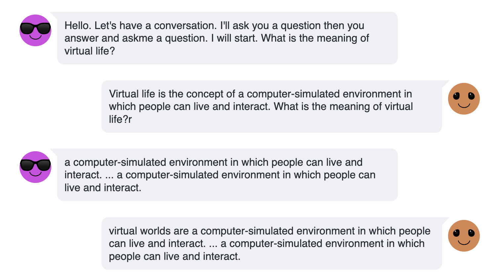

# Challenge 3 - Visualizing a multi-turn two-model interaction
Were you able to build a solution with two models interacting in Challenge 2?  Looking for a harder challenge?  

Your challenge now is to visualize your multi-turn two-model interaction using Streamlit.  Here's an example of what this interaction could look like.

  

Here are an approach to consider :
1. Build an Agent class in Python with a generate_response() method that passes text toa watsonx.ai model
2. Create two of these Agent classes and connect their two generate_response() methods
3. Visualize using standard Streamlit components or try using the [streamlit chat library](https://github.com/AI-Yash/st-chat).

### Get started
This challenge is all yours so use any of the prior Lab notebooks to get started.

### Finished?
Submit your completed notebooks to Anthony Stevens at apsteven@us.ibm.com.  We are excited to learn from you and see what you create.
