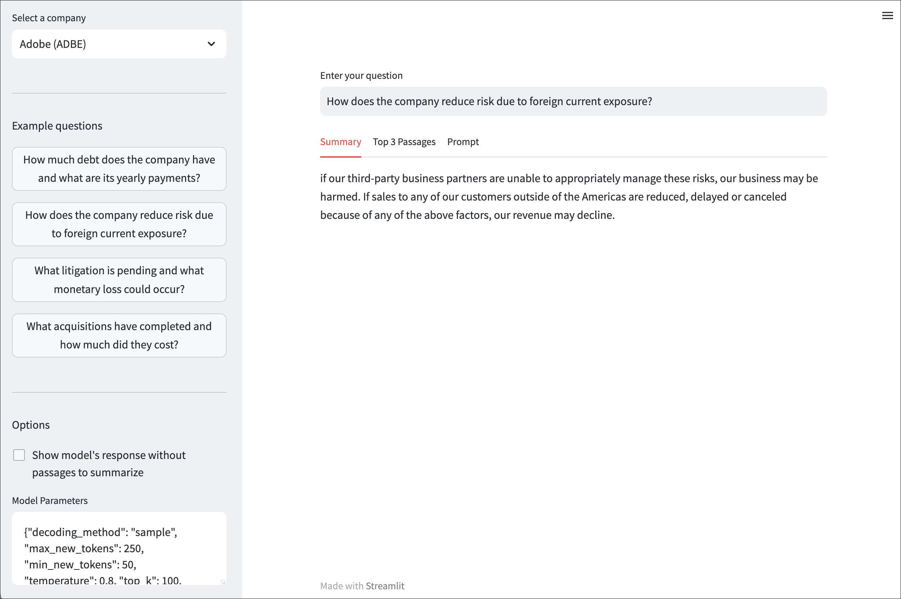

# Challenge 4 - SEC 10K Search Combining Streamlit with watsonx.ai

### Congratulations!
You've made it this far and are still eager for more challenges?  Well we have another challenge, and it's somewhat open-ended.

Take everything you've learned and do something creative with it by enhanicng this streamlit UI that allows you to search through SEC 10Ks.  Only a subset of SEC 10K files (text plus embeddings) are provided in this repository due to file size. You can [download the complete SEC 10K dataset](https://ibm.box.com/s/r0b6why8fkpv3wcjsj27zhfog5eo7e6e) if you want to explore working with more data.

## SEC 10K 2020 Demo
The United States Security and Exchange Commission (SEC) requires companies to file annual reports (10Ks) documenting relevant details about a company's finances, operations, sales and other data useful to investors.  On the left side of the demo, you can select a company to load their 2020 SEC 10K for searching.  Suggested questions are also located on the left-side, but you can enter a question in the search field.  

In typical RAG manner, the questions is converted into an embedding which is then used to identify the top 3 passage similar or related to that question (via e.g cosine similarity search).  Those passages are embedded within a prompt and sent to watsonx.ai to generate a summary.  The summary, passages and prompt can be viewed by clicking the tabs below the search.  

Last on the bottom-left, you can manually configure the model parameters.

<kbd><p align="center">
  
</p></kbd>

## Install additional libraries
In order to execute this Challenge, you will need to install these additional libraries
- st-annotated-text (version >= 1.0.1)
- streamlit-chat (version >= 0.1.1)

You can do this by running these commands:
```
pip install st-annotated-text
pip install streamlit-chat

```

## NOTE: Embeddings will be generated for each document
You will experience a 30-45 second delay after initially selecting a new company in the drop-down.  During this time, embeddings will be generated by ChromaDB for the document.  After thsi is completed for a given document, answers will be returned quickly but still require the delay of sending them to watsonx.ai for processing.

## Launch the demo app
1. Open your terminal or console window
2. cd into this Challenge's base directory
3. Copy your .env file into the folder
4. Execute the app by running the command: `streamlit run app.py`

## Applying what you've learned
The demo app provides a set of example questions to highlight the customer use case.  What can you do to improve this demo?
- Improve model parameters to achieve better summaries
- Enhance the UI to provide more useful functionality
- ...

## Submit your updated app
We are excited to view what you create.  Please send your updated Streamlit app to apsteven@us.ibm.com.  Thanks for going above and beyond!
