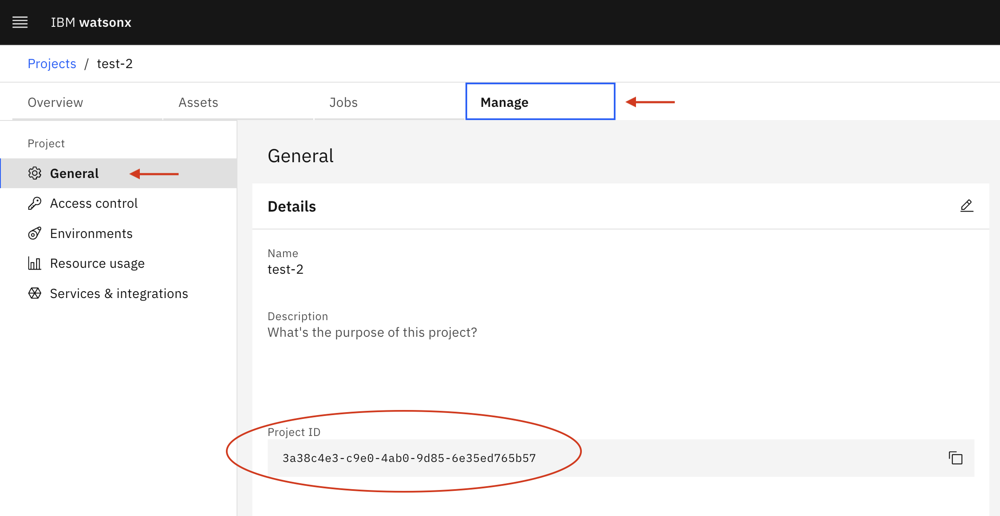

# Desktop Environment Setup

## Introduction
Complete the steps in this guide to ensure your desktop environment has all the required tools and libraries installed.

## Steps to complete
- [1: Connect to watsonx.ai](#connect-to-watsonxai)
- [2: Clone the Workshop's Github repo](#clone-watsonxai-repo)
- [3: Create virtual Python environment (and install required libraries)](#virtual-environment)
- [4. Run Jupyter Notebook and Validate All Libraries Installed](#jupyter-notebook)
- [5. Install Visual Studio Code (VS Code)](#vs-code)
- [6: Obtain your IBM Cloud API key](#obtain-api-key)
- [7: Create a watsonx.ai Project](#create-project)
- [8: Security and .env Files](#environment-files)
- [9: .gitignore files](#gitignore)

### 1: Connect to watsonx.ai <a id="connect-to-watsonxai"></a>
Try connecting to [watsonx.ai](https://dataplatform.cloud.ibm.com/wx/).

### 2: Clone the Workshop's Github repo <a id="clone-watsonxai-repo"></a>
If you're a Github pro then you can directly clone this wastonx.ai workshop repo.  Otherwise we recommend downloading and installing the [Github Desktop](https://desktop.github.com/) and then cloning this watsonx.ai workshop repo. Here are instructions on [how to clone a repository using Github Desktop](https://docs.github.com/en/desktop/contributing-and-collaborating-using-github-desktop/adding-and-cloning-repositories/cloning-a-repository-from-github-to-github-desktop).

### 3: Create Virtual Python Environment and Install Jupyter and Required Libraries <a id="virtual-environment"></a>
Python applications import multiple libraries, and oftentimes, conflicts can occur between different versions of required libraries.  However, your app may require a specific library version due to a bug fix.  The solution is to create a virtual environment, a self-contained suite of libraries for a specific Python installation.

To ensure all required Python libraries are installced, [complete these steps to create your virtual Python environment.](create-virtual-python-environment.md)

**NOTE:** Don't skip setting up your Python environment as the documented steps ensure you have installed Watson Machine Learning Python SDK, Jupyter Notebook, ChromaDB, Hugging Face and all other required libraries.

### 4: Run Jupyter Notebook and Validate All Libraries Installed<a id="jupyter-notebook"></a>
You will be executing several Jupyter notebooks during this workshop.  The Jupyter Notebook executable was installed as part of your Virtual Environment setup in [Step #1](create-virtual-python-environment.md).   You will now ensure that you can run Jupyter Notebooks plus validate that all required Python libraries were installed.

Download this [environment test notebook](./environment-test.ipynb) or use the one that your cloned version of this Github repository.  Use the "cd" command to change to the directory holding those notebooks when ready and launch Jupyter as below.

```
<ensure your python environment is active>
cd <full path to folder containing the environment test notebook>
jupyter notebook
```

Jupyter shoud automatically open a browser window for you.  If not, navigate to http://localhost:8888/notebooks/ to run the notebook.

### 5: Install Visual Studio Code (VS Code) <a id="vs-code"></a>
Most development and data science teams within IBM (and outside) have selected VS Code as their default coding environment.  You can choose to use an alternate IDE for this Boot Camp (like PyCharm or Eclipse), however the Boot Camp coaches will be less skilled at supporting those IDEs.  We recommend installing VS Code so you are on a common platform with most of your IBM colleagues.

Go here to [install VS Code and configure it for your Python environment](vs-code.md)

### 6: Obtain your IBM Cloud API key <a id="obtain-api-key"></a>
You will need your IBM Cloud API key to authenticate the Watson Machine Learning Python SDK client and interact with WatsonX foundation models. **Note that this is the conventional IBM Cloud API key, which you may have already created in the past.** Use your existing API key or follow [these instructions](https://cloud.ibm.com/docs/account?topic=account-userapikey&interface=ui#create_user_key) to generate a new one. You will need this API key for [step 8](#environment-files).

### 7: Create a watsonx.ai Project <a id="create-project"></a>
The Watson Machine Learning Python SDK requires a project ID to interact with watsonx.ai LLMs. Follow the directions below to create a project and retrieve its associated ID.
1. Visit the [watsonx.ai Projects page](https://dataplatform.cloud.ibm.com/projects/?context=wx) and click "Create an empty project". Give your project a valid name, and leave the remaining default options. Click "Create" and verify that your project was successfully created.
2. Once your new project loads, select the "Manage" tab from the Project's main page. You will see your Project ID under the "General" tab as shown below. You will need this project ID for [step 8](#environment-files).

<p align="left">
  
</p>

### 8: Security and .env Files<a id="environment-files"></a>
A guaranteed way to get contacted by IBM's Github security team is to check-in code that contains an access credential for an IBM Cloud service.  To avoid this, store credentials in a .env file, then ensure this .env **is not checked into Github.**  Python provides support for .env files through a library called dotenv that you will encounter during some lessons in this Boot Camp.

Download this [env file](./env), open it in a text editor and 
1. add your IBM Cloud API key from [step 6](#obtain-api-key) in the API_KEY field
2. add your project ID from [step 7](#create-project) in the PROJECT_ID field

Add a period to the downloaded "env" file to it is ".env".  You may get a warning that this will convert this to a hidden file so [learn how to view these hidden files on a Mac](https://www.macworld.com/article/671158/how-to-show-hidden-files-on-a-mac.html) or [how to view hidden files on Windows](https://support.microsoft.com/en-us/windows/view-hidden-files-and-folders-in-windows-97fbc472-c603-9d90-91d0-1166d1d9f4b5).

If you are still having trouble renaming the “env” file to “.env”, type the following commands in your terminal:
```
cd <path to folder containing your env file>
mv env .env
```
To check that the file was changed to .env, type the following command: 
```
ls -la 
```

### 9: .gitignore Files <a id="gitignore"></a>
Whenever checking code into a Github repo, use .gitignore to exclude files from being checked-in.  If you don't know how to do this, [learn how to add your .env to .gitignore](https://salferrarello.com/add-env-to-gitignore/).
