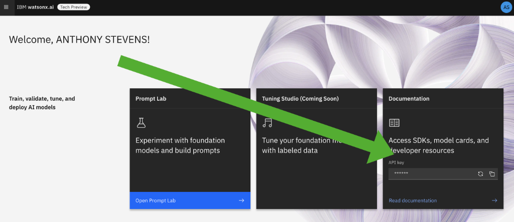

# Desktop Environment Setup

## Introduction
Complete the steps in this guide to ensure your desktop environment has all the required tools and libraries installed.

## Steps to complete
- [1: Connect to watsonx.ai](#connect-to-watsonxai)
- [2: Clone the Workshop's Github repo](#clone-watsonxai-repo)
- [3: Create virtual Python environment (and install required libraries)](#virtual-environment)
- [4. Run Jupyter Notebook](#jupyter-notebook)
- [5. Install Visual Studio Code (VS Code)](#vs-code)
- [6: Access watsonx.ai Workbench](#access-watsonxai-workbench)
- [7: Security and .env Files](#environment-files)
- [8: .gitignore files](#gitignore)

### 1: Connect to watsonx.ai <a id="connect-to-watsonxai"></a>
Try connecting to the [watsonx.ai Workbench](https://workbench.res.ibm.com/).  If you don't have access then contact the workshop leads for access.

### 2: Clone the Workshop's Github repo <a id="clone-watsonxai-repo"></a>
If you're a Github pro then you can directly clone the [wastonx.ai workshop repo](https://github.ibm.com/skol-assets/bootcamp-watsonx-ai).  Otherwise we recommend downloading and installing the [Github Desktop](https://desktop.github.com/) and then cloning the [watsonx.ai workshop repo](https://github.ibm.com/skol-assets/bootcamp-watsonx-ai). Here are instructions on [how to clone a repository using Github Desktop](https://docs.github.com/en/desktop/contributing-and-collaborating-using-github-desktop/adding-and-cloning-repositories/cloning-a-repository-from-github-to-github-desktop).

### 3: Create Virtual Python Environment and Install Jupyter and Required Libraries <a id="virtual-environment"></a>
Python applications import multiple libraries, and oftentimes, conflicts can occur between different versions of required libraries.  However, your app may require a specific library version due to a bug fix.  The solution is to create a virtual environment, a self-contained suite of libraries for a specific Python installation.

To ensure all required Python libraries are installced, [complete these steps to create your virtual Python environment.](create-virtual-python-environment.md)

**NOTE:** Don't skip setting up your Python environment as the documented steps ensure you have installed IBM GenAI Python library, Jupyter Notebook, ChromaDB, Hugging Face and all other required libraries.

### 4: Run Jupyter Notebook <a id="jupyter-notebook"></a>
You will have installed Jupyter Notebooks as part of your Virtual Environment setup in [Step #1](create-virtual-python-environment.md). There are several Jupyter notebooks in this Boot Camp.  Use the "cd" command to change to the directory holding those notebooks when ready and launch Jupyter as below.
```
cd <full path to folder with notebook to execute>
jupyter notebook
```
You can now open a browser window and navigate to http://localhost:8888/notebooks/ to create a notebook.

### 5: Install Visual Studio Code (VS Code) <a id="vs-code"></a>
Most development and data science teams within IBM (and outside) have selected VS Code as their default coding environment.  You can choose to use an alternate IDE for this Boot Camp (like PyCharm or Eclipse), however the Boot Camp coaches will be less skilled at supporting those IDEs.  We recommend installing VS Code so you are on a common platform with most of your IBM colleagues.

Go here to [install VS Code and configure it for your Python environment](vs-code.md)

### 6: Access Watsonx.ai Workbench <a id="access-watsonxai-workbench"></a>
Log in to the [Watsonx.ai Workbench](https://workbench.res.ibm.com/) to retrieve your API Key from the right-side of the home screen.  Save this key as we will be using it during the next step.  

<p align="center">
  
</p>

### 7: Security and .env Files<a id="environment-files"></a>
A guaranteed way to get contacted by IBM's Github security team is to check-in code that contains an access credential for an IBM Cloud service.  To avoid this, store credentials in a .env file, then ensure this .env **is not checked into Github.**  Python provides support for .env files through a library called dotenv that you will encounter during some lessons in this Boot Camp.

Download this [env file](./env), open it in a text editor and add your watsonx.ai API key in the GENAI_KEY field. This is also described on the watsonx.ai page describing the [GenAI python library](https://workbench.res.ibm.com/docs/ibm-generative-ai).

Add a period to the downloaded "env" file to it is ".env".  You may get a warning that this will convert this to a hidden file so [learn how to view these hidden files on a Mac](https://www.macworld.com/article/671158/how-to-show-hidden-files-on-a-mac.html) or [how to view hidden files on Windows](https://support.microsoft.com/en-us/windows/view-hidden-files-and-folders-in-windows-97fbc472-c603-9d90-91d0-1166d1d9f4b5).

If you are still having trouble renaming the “env” file to “.env”, type the following commands in your terminal:
```
cd <path to folder containing your env file>
mv env .env
```
To check that the file was changed to .env, type the following command: 
```
ls -la 
```

### 8: .gitignore Files <a id="gitignore"></a>
Whenever checking code into a Github repo, use .gitignore to exclude files from being checked-in.  If you don't know how to do this, [learn how to add your .env to .gitignore](https://salferrarello.com/add-env-to-gitignore/).
