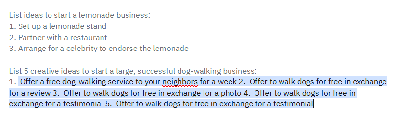
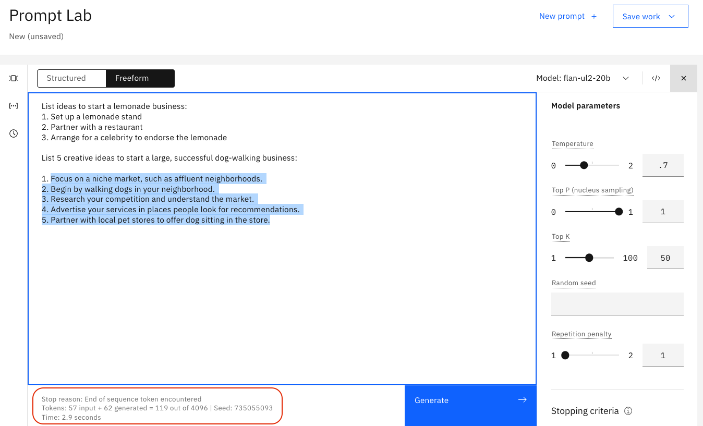
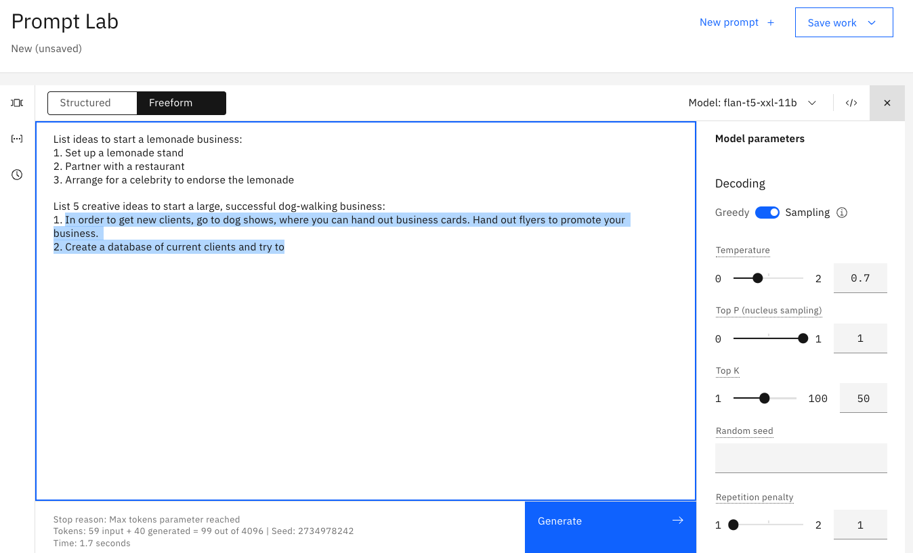
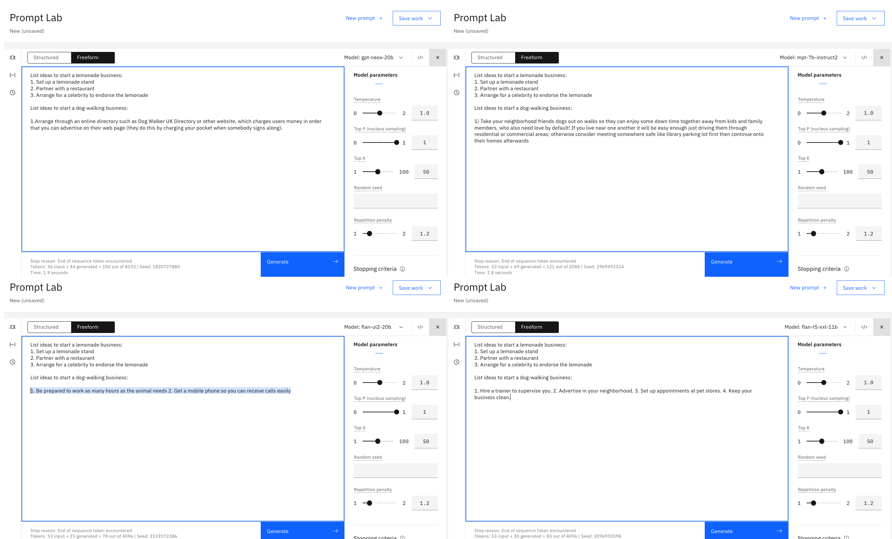

# Prompt engineering

### 1.0 Balancing intelligence and security
With great artificial intelligence comes security risks. Solutions like ChatGPT are more than Large language Models (LLMs).  ChatGPT's underlying LLMs have been fine-tuned by the OpenAI teams using an additional Chat dataset plus a RLHF (Reinforcement Learning Human Feedback) dataset so it's much more than a standard LLM, it's a chatbot-enabled LLM.  An LLM with 175 billion parameters. 

In watsonx.ai, we are interacting directly with smaller LLMs (3-20 billion parameters).  This is a wise choice from a security POV. Prompt injection is a major risk for enterprise uses of LLMs. In prompt injections, a hacker will create an intricate prompt in order to cause a LLM such as ChatGPT to ignore/bypass security protocols and reveal sensitive company information. Just imagine you're a hacker.  Which model would you choose to target for prompt injection? OpenAI's ChatGPT with 175 billion parameters or the smaller and more-focused Prompt-Tuned 3 billion parameter models that you'll eventually be building?  Which has a larger attack surface for prompt re-engineering?

As you can imagine, using relatively smaller models such as those utilized in watsonx.ai creates a much bigger challenge for a potential hacker. Using many small models rather than a single large one such as ChatGPT creates a wide distribution of sensitive data. In addition, each small language model is much harder (if not impossible) to manipulate due the high level of prompt engineering that is needed for them to perform their primary tasks. They don’t have the wide range of functions such as ChatGPT (e.g. chatbot capabilities), so the majority of prompt injection attempts will be misunderstood or ignored by the language model agent.

That's right.  For security, smaller is better. On top of security benefits, there computational improvements with using smaller, lighter weight models as well. However we're getting ahead of ourselves.  Let's first interact with a few of watsonx.ai's LLMs to better understand and learn how to make them respond the way we need.

**Note:** The following images show actual results from watsonx.ai. The slight gray text is what we provided to the model.  The blue highlighted text is how the model responded.

### 1.1 LLM Foundations

Before we jump into exploring the capabilities of watsonx.ai, we first need to lay a foundation for how each of our LLMs works, and how we can tune the model and parameters to change our output. Gaining this understanding will make us more effective prompt engineers, and we will be able to apply these changes throughout the remaining labs even as we utilize the API in our Python environments!


When you open up your prompt lab, this is the view you will be shown.  Each time you enter a prompt, you will have “input tokens” and “generated tokens”. Tokens are to our model what words are to us — although they can vary. Depending on the circumstance, tokens can be sequences of characters or even words themselves. As you will see when you experiment with the prompt lab, tokens are not necessarily a 1:1 match with words in natural language, but it is an approximation you can use when trying to estimate!

It is important to understand what tokens are so that you know how much information you are feeding the model when you give it a prompt, as well as how much information you expect it to generate for you. There is a max of 4096 tokens in the prompt builder, so keep in mind that the more expressive you are with your prompt instructions, the less room the model will have to respond back to you.

### 1.2 Everything is text completion

watsonx.ai is not a chatbot interface so just specifying an instruction or question rarely produces a good result. For instance, what if we ask Watsonx.ai to:
```List ideas to start a dog-walking business?```


<p> </p>

### 1.3 Cue the output structure

We can see from the above example that simple prompts do not work with smaller LLMs.  To receive a structured response, include a cue to start the response in the desired structure.  For example, just adding these two characters, "1.", dramatically improves the response.


<p> </p>

### 1.4 Provide an example as guidance (or Single Shot Prompting)

To receive a higher-quality response, provide an example of the kind of response you want.  In technical terms, this is called Single Shot Prompting. 


As you can see, providing one example before generating with your LLM is called Single Shot Prompting, but adding more examples into your prompt is common practice as well. Generally, increasing the number of examples is referred to as “Few Shot Prompting” and is a powerful tool to ensure you have a specific output.

Copy paste to get started experimenting:

```
List ideas to start a lemonade business:
1. Setup a lemonade stand
2. Partner with a restaurant
3. Arrange for a celebrity to endorse the lemonade

List ideas to start a dog-walking business:
1. 
```

### 1.5 Include descriptive details

The more guidance, the better:

- Content
- Style
- Length



# Model Parameters


### 2.0 Adjusting the model's behaviour
The first change we can make is what model (LLM) we use to evaluate our prompt. This is one of the biggest changes you can make, as certain models are better built for specific tasks. The exercises later on this lab will force you to change the model you use if you want to answer some of the more challenging questions.

In general, some models perform better working with summarization, key words, and semantics, while other models do better with structured text such as HTML, markdown, or JSON. The best way to figure out which models apply for your use case is to simply test them, but it is important to know that choice of model can make a big difference!

watsonx.ai also provides multiple parameters for configuring how LLMs respond to a prompt.  Selecting the correct parameters can often be more art than science.  Investing time into understanding then tweaking these parameters will be rewarded by better responses.

Explore these parameters with the following text:
```
List ideas to start a lemonade business:
1. Setup a lemonade stand
2. Partner with a restaurant
3. Arrange for a celebrity to endorse the lemonade

List ideas to start a dog-walking business:
1. 
```

### 2.1 Set the min and max tokens

If you're finding the generated text is too short or too long, try adjusting the parameters that control the number of new tokens:

- The **Min new tokens** parameter controls the minimum number of tokens (~words) in the generated response
- The **Max new tokens** parameter controls the maximum number of tokens (~words) in the generated response




### 2.2 Specify stop sequences

If you specify stop sequences, the output will automatically stop when one of the stop sequences appears in the generated output.

**Example**

The output in the following image goes too far, there are two answers:


In the following image, the stop sequence of two carriage returns is specified:


The following image shows the effect of the stop sequence.  The output stops after two carriage returns:


<p> </p>

### 2.3 Adjust decoding parameters

If the response is too generic or going on wild tangents, consider adjusting the decoding parameters.  Or conversely, the response may not be creative enough.

**Decoding** is the process of finding the output sequence given the input sequence:

- **Greedy decoding** selects the word with the highest probability at each step of the decoding process. 
- **Sampling decoding** selects words from a probability distribution at each step:
  - **Temperature** refers to selecting high- or low-probability words.  Higher temperature values lead to more variability.
  - **Top-p** (nucleus sampling) refers to selecting the smallest set of words whose cumulative probability exceeds p.
  - **Top-k** refers to selecting k words with the highest probabilities at each step.  Higher values lead to more variability.

An advantage of greedy decoding is that you will see reproducible results. This can be useful for testing.
Setting temperature to 0 in a sampling decoding approach gives the same variance as greedy decoding.




See:

- [Most-used decoder methods](https://medium.com/nlplanet/two-minutes-nlp-most-used-decoding-methods-for-language-models-9d44b2375612)
- [Using different decoding methods](https://huggingface.co/blog/how-to-generate)

<p> </p>

### 2.4 Add a repetition penalty

Sometimes, you'll see text being repeated over and over:


Increasing the temperature can sometimes resolve the problem.

However, when text is still repetative even with a higher temperature, you can try adding a repetition penality.  The higher the penalty, the less likely the results will include repeated text.


This example shows the challenge: the bullet points are repetition that we want!  So penalizing repetitiveness might break your results too.

# General advice

### 3.1 Try different models

The watsonx.ai documentation describes the available models: [watsonx.ai models](https://workbench.res.ibm.com/docs/models)



### 3.2 Guidelines for Using LLMs at IBM
Refer to the [Guidelines for using LLMs in IBM work](https://github.ibm.com/spackows/2023-Workshop-LLMs-for-CD/blob/main/Day-1-instructions.md#guidelines-for-using-llms-in-ibm-projects)

### 3.3 Check your use case

LLMs have great potential, but they have no logic, no knowledge, and no domain expertise.  Some use cases are a better fit than others: LLMs excel at tasks that involve generating generic text or common code patterns and transforming given input.

If your prompt includes all the tips and best practices discussed here, yet you're not getting good results from any of the models, consider whether your use case might be one that LLMs just cannot handle well.

For example, although we can get decent results for simple arithmetic, LLMs cannot generally do math well: [Researchers find that large language models struggle with math](https://venturebeat.com/business/researchers-find-that-large-language-models-struggle-with-math/)

<p> </p>

# Further learning

- [OpenAI prompt intro](https://platform.openai.com/docs/guides/completion/prompt-design)
- [OpenAI prompt engineering tutorial](https://help.openai.com/en/articles/6654000-best-practices-for-prompt-engineering-with-openai-api)
- [co:here prompt engineering tutorial](https://docs.cohere.ai/docs/prompt-engineering)
