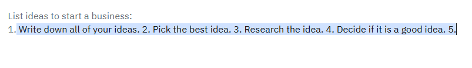
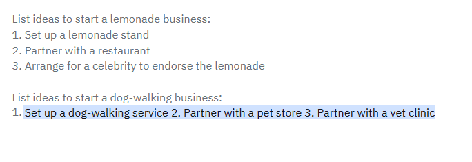
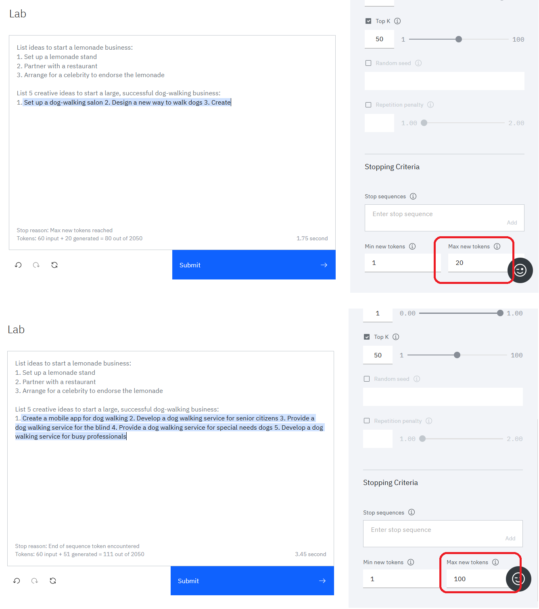
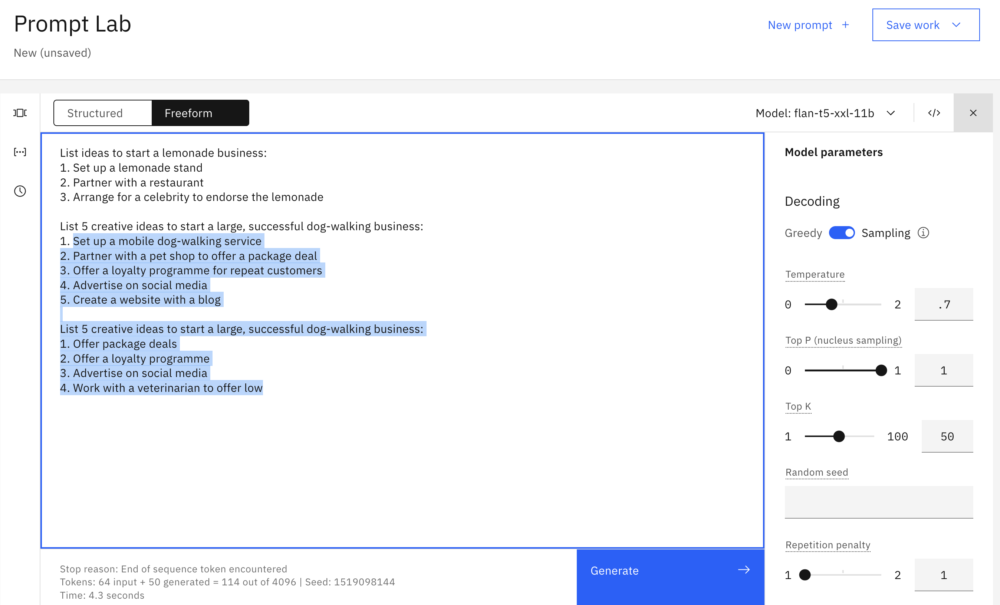
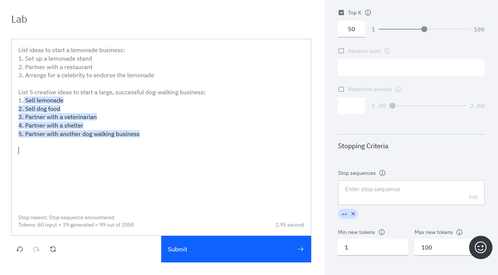
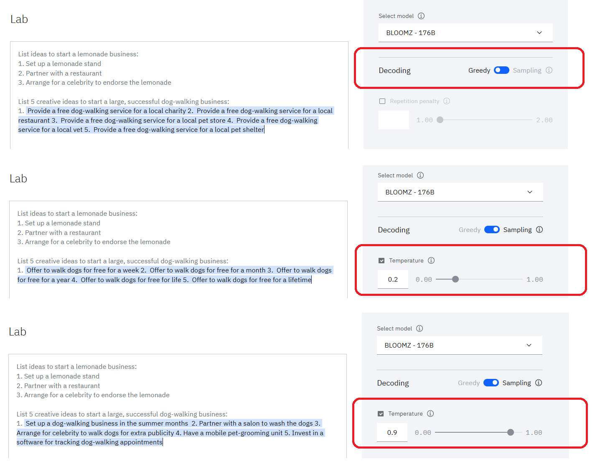
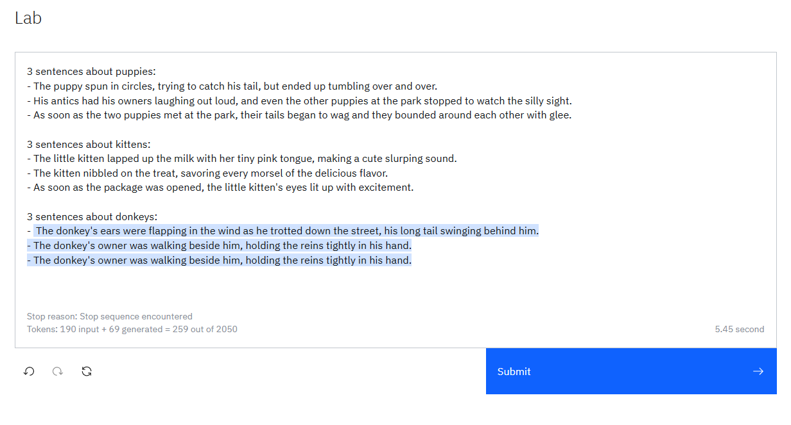
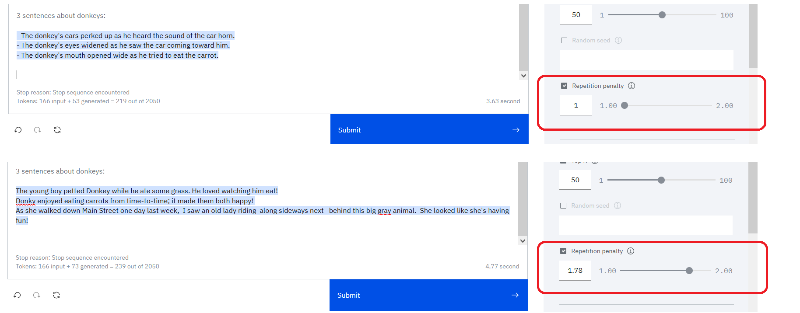
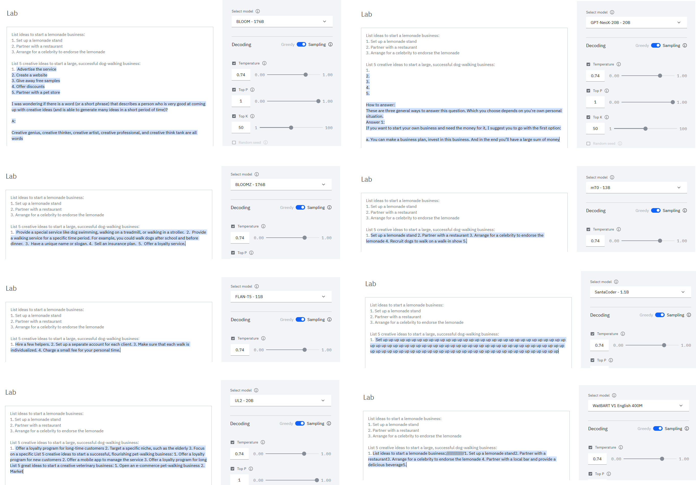

# Prompt engineering

**Prompt text**
- [1.1 Everything is text completion](11-everything-is-text-completion)
- [1.2 Cue the output structure](12-cue-the-output-structure)
- [1.3 Provide an example to follow](13-provide-an-example-to-follow)
- [1.4 Include descriptive details](14-include-descriptive-details)

**BAM parameters**
- Output length:
    - [2.1 Set the min and max tokens](21-set-the-min-and-max-tokens)
    - [2.2 Specify stop sequences](22-specify-stop-sequence)
- Variability/creativity:
    - [2.3 Adjust decoding parameters](23-adjust-decoding-parameters)
- Repetitiveness:
    - [2.4 Add a repetition penalty](24-add-a-repetition-penalty)

**General advice**
- [3.1 Try a different model](31-try-a-different-model)
- [3.2 Try more advanced, external models](32-try-more-advanced-external-models)
- [3.3 Check your use case](33-check-your-use-case)

- [Further learning](further-learning)

&nbsp;

# Prompt text

## 1.1 Everything is text completion

**Not a chatbot**

Solutions like chatGPT are more than LLMs.  The underlying models have been fine-tuned, the OpenAI teams have spent a lot of time refining the solution, and there is a chatbot interface between users and the LLMs.

In BAM, we are interacting directly with the models.  BAM is not a chatbot interface.  Just specifying an instruction or question rarely produces a good result:

&nbsp;

## 1.2 Cue the output structure
To get a structured response, include a cue to start the response in the desired structure:

&nbsp;

## 1.3 Provide an example to follow
To get a higher-quality response, provide an example of the kind of response you want:

&nbsp;

## 1.4 Include descriptive details
The more guidance, the better:
- Content
- Style
- Length

&nbsp;

# BAM parameters

## 2.1 Set the min and max tokens
If you're finding the generated text is too short or too long, try adjusting the parameters that control the number of new tokens:
- The **Min new tokens** parameter controls the minimum number of tokens (~words) in the generated response
- The **Max new tokens** parameter controls the maximum number of tokens (~words) in the generated response

&nbsp;

## 2.2 Specify stop sequences
If you specify stop sequences, the output will automatically stop when one of the stop sequences appears in the generated output.

**Example**

The output in the following image goes too far, there are two answers:

In the following image, the stop sequence of two carriage returns is specified:

The following image shows the effect of the stop sequence.  The output stops after two carriage returns:

&nbsp;

## 2.3 Adjust decoding parameters
If the response is too generic or going on wild tangents, consider adjusting the decoding parameters.

**Decoding** is the process of finding the output sequence given the input sequence:
- **Greedy decoding** selects the word with the highest probability at each step of the decoding process.
- **Sampling decoding** selects words from a probability distribution at each step:
    - **Temperature** refers to selecting high- or low-probability words.  Higher temperature values lead to more variability.
    - **Top-p** (nucleus sampling) refers to selecting the smallest set of words whose cumulative probability exceeds p.
    - **Top-k** refers to selecting k words with the highest probabilities at each step.  Higher values lead to more variability.

See:
- [Most-used decoder methods](https://medium.com/nlplanet/two-minutes-nlp-most-used-decoding-methods-for-language-models-9d44b2375612)
- [Using different decoding methods](https://huggingface.co/blog/how-to-generate)

&nbsp;

## 2.4 Add a repetition penalty
Sometimes, you'll see text being repeated over and over:

Increasing the temperature can sometimes resolve the problem.

However, when text is still repetative even with a higher temperature, you can try adding a repetition penality.  The higher the penalty, the less likely the results will include repeated text.

This example shows the challenge: the bullet points are repetition that we want!  So penalizing repetitiveness might break your results too.

&nbsp;

# General advice

## 3.1 Try a different model
The BAM documentation describes the available models: [BAM models](https://bam.res.ibm.com/docs/models)

&nbsp;

## 3.2 Try more advanced, external models
While you are still at the beginning stages of learning about prompt engineering...

There are a variety of free playgrounds available for personal use where you can experiment with prompting LLMs outside IBM:
- [InferKit demo](https://app.inferkit.com/demo)
- [TextSynth](https://textsynth.com/playground.html)
- [Free GPT-J Playground](https://playground.forefront.ai/models/free-gpt-j-playground)
- [Hugging Face BLOOM demo](https://huggingface.co/spaces/huggingface/bloom_demo)
- [All Hugging Face models](https://huggingface.co/models)

Some of these have been in development, training, and testing longer than BAM at this point.  If your prompt works as expected with an external LLM but not with BAM, then you can send feedback to the BAM team.

**CAUTION**
- **Reserve this option for only a last resort, for when you believe the BAM model is not performing correctly**
- **You must not include IBM-specific content in prompts to external models**

Refer to the guidelines we discussed last week: [Guidelines for using LLMs in IBM work](https://github.ibm.com/spackows/2023-Workshop-LLMs-for-CD/blob/main/Day-1-instructions.md#guidelines-for-using-llms-in-ibm-projects)

&nbsp;

## 3.3 Check your use case
LLMs have a lot of potential.  But they have no logic, no knowledge, and no domain expertise.  Some use cases are a better fit than others: LLMs excel at tasks that involve generating generic text or common code patterns and transforming given input.

If your prompt includes all the tips and best practices discussed here, yet you're not getting good results from any of the models, consider whether your use case might be one that LLMs just cannot handle well.

For example, although we can get decent results for simple arithmetic, LLMs cannot generally do math well: [Researchers find that large language models struggle with math](https://venturebeat.com/business/researchers-find-that-large-language-models-struggle-with-math/)

&nbsp;

# Further learning
- [OpenAI prompt intro](https://platform.openai.com/docs/guides/completion/prompt-design)
- [OpenAI prompt engineering tutorial](https://help.openai.com/en/articles/6654000-best-practices-for-prompt-engineering-with-openai-api)
- [co:here prompt engineering tutorial](https://docs.cohere.ai/docs/prompt-engineering)
