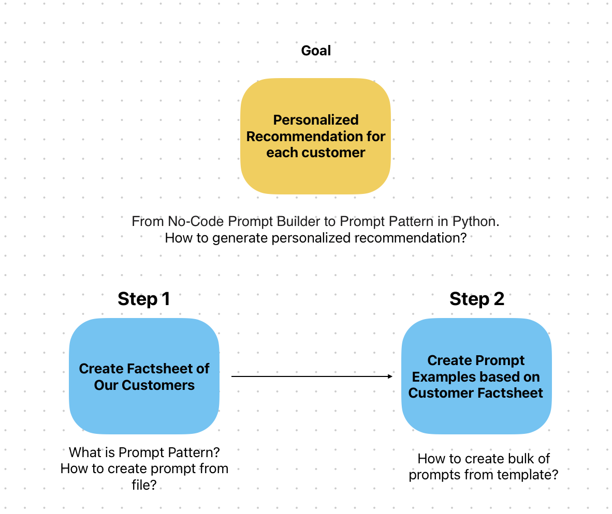

# Lab 3: IBM's GenAI Python Library and Prompt Patterns

### Introduction
Welcome to the Lab 3. In the previous lab, we explored the challenges of prompt engineering; learning how to tweak our wording, choose different models plus optimize model parameters. Minor changes can significantly enhance the results generated by language models.

In this lab, we will apply our new knowledge to a real-world use case as we continue learning about coding prompts in Python using the [LangChain Python library](https://langchain-contrib.readthedocs.io/en/latest/) to programmatically interact with Watsonx.ai. We will learn to use Prompt Pattern templates to streamline our interaction with the language model and maximize its potential.

  

### Getting Started
Let's get started and unlock the full potential of Prompt Patterns for generating personalized recommendations at XYZ Retail! Execute the [Intro to Using langChain Python Library notebook](./langchain-prompt-template.ipynb).

**Note:** Be sure to have cloned this entire repo or you won't have the images and data required to execute these notebooks.
