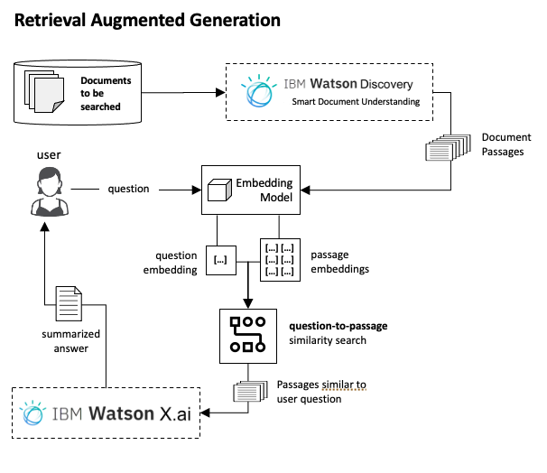

# Lab 6: Retrieval Augment Generation (RAG) for Contextual Search

### Introduction
In this lab, you will apply Retrieval Augment Generation (RAG) to retrieve then summarize text based on user queries.  Here is a high level view of a RAG implementation.  

  

In this lab, you will not use Watson Discovery as the documents have already been pre-processed and made available to you.  However a later lab will show you how to use Smart Document Understanding in Watson Discovery to extract passaged from documents.

Proceed to the [RAG lab notebook](./rag-chromadb-flan.ipynb) to continue your learning.

#### Credits
This lab was based off a [cookbook](https://github.ibm.com/Gen-AI/ibm-generative-ai-cookbooks/blob/main/notebooks/rag-chromadb-flan.ipynb) created by the IBM Research team.
