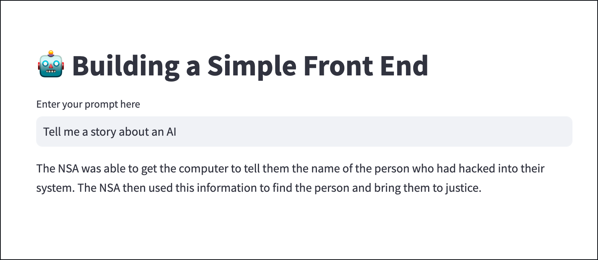

# Building  Apps with watsonx.ai and Streamlit
So I'm guessing you've been hearing a bit about watsonx. Well...now you can build your very own app with it🙌 (I know...crazy right?!). In this tutorial you'll learn how to build your own LLM powered Streamlit with the IBMGen library.  

# Startup 🚀
1. Open your terminal or console window
2. cd into this lab's base directory
3. Copy your .env file into this lab's base folder
4. Run the app by running the command `streamlit run app.py`

# Other References 🔗

-<a href="https://workbench.res.ibm.com/docs/ibm-generative-ai">IBMGen Documentation</a>: documentation for the IBMGen library available through the tech preview UI.

-<a href="https://github.com/IBM/ibm-generative-ai#langchain-extension">IBMGen Langchain Extension</a>: Langchain is a highly popular LLM library, it's used to structure prompt chains and llm workflows. In this tutorial we use the IBMGen langchain extension to generate responses.

👨🏾‍💻 Author: Nick Renotte

