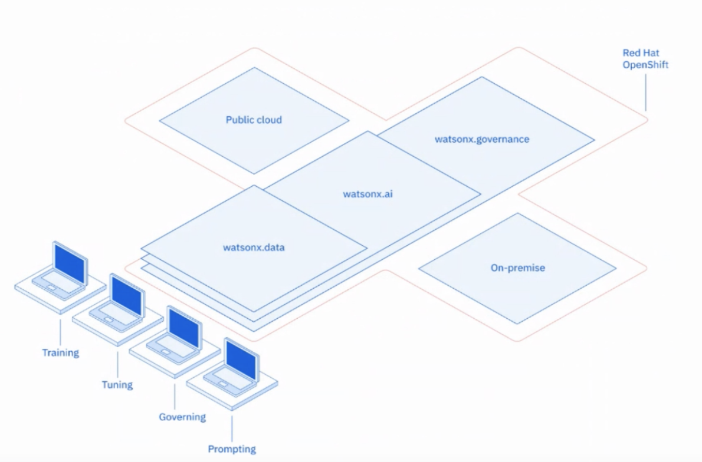

# Technical POV on watsonx.ai

## Required Viewing
[Click this link and skip to 9:45 mins into the video and watch until 29:30](https://ibm.seismic.com/app?ContentId=84ed761e-82b9-4fd5-bbd7-58750f13849f) to hear Sriram Raghavan, Vice President for IBM Research AI, describe watsonx.ai from a technical POV.

### Watsonx.ai in Context

  

